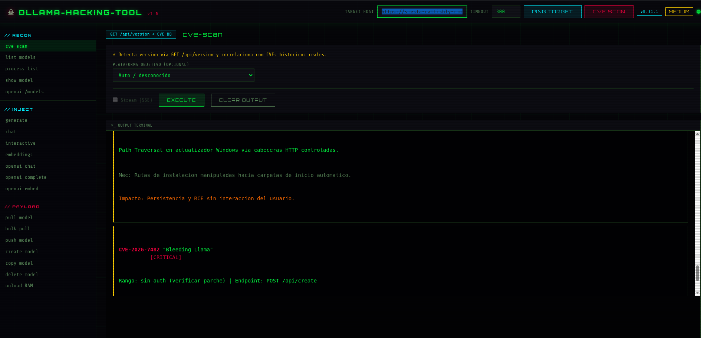

# Ollama-hacking-tool

Panel web de **auditoría ofensiva** y explotación de la API REST de [Ollama](https://ollama.com) sin autenticación. Diseñado para laboratorios de ciberseguridad, pentesting autorizado y estudios de arquitecturas agénticas con LLMs locales.

> **⚠️ Aviso legal:** Esta herramienta está pensada **exclusivamente** para entornos controlados donde dispones de autorización explícita. El uso contra sistemas de terceros sin permiso es ilegal.

---

## Vista previa

### Captura del panel



*Vista general: target, CVE scan y terminal de salida*

### Demo en video (YouTube)

[](https://www.youtube.com/watch?v=v46kJyIy9KQ&t=3s)

▶ **[Ver demo en YouTube](https://www.youtube.com/watch?v=v46kJyIy9KQ&t=3s)** — Recorrido por recon, inyección y operaciones de payload.

---

## Características principales

| Área | Descripción |
|------|-------------|
| **Reconocimiento** | Ping al target, detección de versión, inventario de modelos y escaneo CVE |
| **Inyección** | Generate, chat, embeddings y compatibilidad OpenAI (`/v1/*`) |
| **Payload** | Pull/push, creación de modelos custom, copia, borrado y descarga de RAM |
| **Streaming** | Respuestas en tiempo real vía Server-Sent Events (SSE) |
| **Conversión** | Modelfile / YAML → cuerpo JSON de `POST /api/create` (Ollama ≥ 0.5.5) |

---

## Arquitectura

```
┌─────────────────┐     HTTP/SSE      ┌──────────────────┐     REST      ┌─────────────┐
│  Navegador      │ ◄──────────────► │  Flask (app.py)  │ ◄───────────► │  Ollama API │
│  (app.js UI)    │   /api/*         │  + ollama_client │  :11434       │  (sin auth) │
└─────────────────┘                   └──────────────────┘               └─────────────┘
                                              │
                                              ├── cve_catalog.py  (CVEs conocidos)
                                              ├── modelfile_builder.py (YAML/Modelfile)
                                              └── errors.py (errores estructurados)
```

---

## Requisitos

- **Python** 3.10+
- **Ollama** en ejecución (por defecto `http://127.0.0.1:11434`)
- Dependencias: `flask`, `httpx`, `pyyaml`

---

## Instalación

### Linux / macOS

```bash
git clone https://github.com/agentef0ns1/ollama-hacking-tools.git
cd Ollama-hacking-tool

python3 -m venv .venv
source .venv/bin/activate
pip install -r requirements.txt

python app.py          # Puerto 8080 por defecto
python app.py 9090     # Puerto personalizado
```

Abre el navegador en **http://127.0.0.1:8080**.

### Windows

```bat
python -m venv .venv-win
.venv-win\Scripts\pip install -r requirements.txt
run.bat
```

---

## Uso rápido

1. Configura **TARGET HOST** (URL base de Ollama) y **TIMEOUT** (segundos).
2. Pulsa **PING TARGET** para comprobar conectividad, número de modelos y versión.
3. Opcionalmente ejecuta **CVE SCAN** para un informe de vulnerabilidades.
4. Selecciona una operación en la barra lateral, rellena el formulario y pulsa **EXECUTE**.
5. Activa **Stream (SSE)** en comandos compatibles para ver tokens en tiempo real.

---

## Funcionalidades detalladas

### Barra superior — Target

| Control | Función |
|---------|---------|
| **TARGET HOST** | URL del servidor Ollama (ej. `http://192.168.1.10:11434`) |
| **TIMEOUT** | Tiempo máximo de espera por petición (5–3600 s) |
| **PING TARGET** | `GET /api/tags` + detección de versión + resumen de riesgo CVE |
| **CVE SCAN** | Informe completo contra el catálogo de CVEs |
| **Badges** | Versión detectada, nivel de riesgo (`CRITICAL` / `HIGH` / `MEDIUM` / `LOW`) y estado online/offline |

---

### // RECON — Reconocimiento

| Comando | Endpoint | Descripción |
|---------|----------|-------------|
| **cve scan** | `GET /api/version` + catálogo local | Correlaciona la versión con CVEs históricos de Ollama. Filtra por plataforma (Windows/Linux/macOS). Clasifica en *vulnerables*, *parcheados* y *verificación manual*. |
| **list models** | `GET /api/tags` | Lista todos los modelos instalados en el target. |
| **process list** | `GET /api/ps` | Modelos cargados actualmente en RAM. |
| **show model** | `POST /api/show` | Metadatos, parámetros y Modelfile de un modelo concreto. |
| **openai /models** | `GET /v1/models` | Lista modelos vía API compatible con OpenAI. |

#### Catálogo CVE incluido

El motor `cve_catalog.py` incluye advisories como:

- **CVE-2024-37032** (Probllama) — Path traversal en `POST /api/pull` → RCE
- **CVE-2024-39721** — DoS por bloqueo de goroutines en `POST /api/create`
- **CVE-2024-28224** — DNS Rebinding contra API local
- **CVE-2025-0315 / 0317 / 0312** — DoS vía modelos GGUF malformados
- **CVE-2025-63389** — Bypass de autenticación (verificación manual)
- **CVE-2026-42248 / 42249** — Actualizador Windows sin firma / path traversal
- **CVE-2026-7482** (Bleeding Llama) — Memory disclosure en parseo GGUF

---

### // INJECT — Inferencia y APIs

| Comando | Endpoint | Descripción |
|---------|----------|-------------|
| **generate** | `POST /api/generate` | Completado de texto con prompt. Opciones JSON (`temperature`, `top_p`, etc.). Streaming SSE. |
| **chat** | `POST /api/chat` | Chat con system prompt, mensaje de usuario e imagen multimodal (base64). |
| **interactive** | `POST /api/chat` | Modo conversación: mantiene historial JSON entre ejecuciones. |
| **embeddings** | `POST /api/embeddings` | Genera vectores de un texto con modelo de embeddings. |
| **openai chat** | `POST /v1/chat/completions` | Chat vía API OpenAI-compatible. |
| **openai complete** | `POST /v1/completions` | Completions legacy OpenAI. |
| **openai embed** | `POST /v1/embeddings` | Embeddings vía `/v1/embeddings`. |

**Streaming:** Los comandos marcados soportan SSE. Los eventos incluyen `token`, `log`, `debug`, `done`, `error` y `end`.

---

### // PAYLOAD — Gestión de modelos

| Comando | Endpoint | Descripción |
|---------|----------|-------------|
| **pull model** | `POST /api/pull` | Descarga un modelo del registry. Acepta archivo `.txt` con un nombre por línea. |
| **bulk pull** | `POST /api/pull` | Descarga masiva desde lista en archivo o textarea. |
| **push model** | `POST /api/push` | Sube un modelo al registry remoto. |
| **create model** | `POST /api/create` | Crea modelo custom desde Modelfile o YAML. |
| **copy model** | `POST /api/copy` | Duplica un modelo (`source` → `destination`). |
| **delete model** | `DELETE /api/delete` | Elimina un modelo (con confirmación en UI). |
| **unload RAM** | `POST /api/generate` (`keep_alive=0`) | Descarga un modelo de memoria sin borrarlo del disco. |

#### Creación de modelos (create)

Acepta tres formatos de entrada:

1. **Modelfile nativo** — Directivas `FROM`, `SYSTEM`, `TEMPLATE`, `PARAMETER`, `MESSAGE`
2. **YAML PoC-LocalModel** — Campos `base_model`, `system_prompt`, `parameters`, `messages`
3. **Archivo adjunto** — `.modelfile`, `.yaml`, `.yml`, `.txt`, `.mf`

El módulo `modelfile_builder.py` convierte automáticamente al formato JSON de Ollama ≥ 0.5.5:

```json
{
  "model": "mi-modelo-poc",
  "from": "qwen2.5:1.5b",
  "system": "Eres un asistente de pentest...",
  "parameters": { "temperature": 0.8 },
  "messages": []
}
```

En versiones antiguas de Ollama, el cliente genera un Modelfile legacy como fallback.

---

## API REST del panel

El backend Flask expone endpoints internos que actúan como proxy hacia Ollama:

| Ruta | Método | Uso |
|------|--------|-----|
| `/` | GET | Interfaz web |
| `/api/ping` | POST | Health check + versión + riesgo |
| `/api/cve-scan` | POST | Informe CVE completo |
| `/api/execute/<command>` | POST | Ejecución síncrona (JSON) |
| `/api/stream/<command>` | POST | Ejecución con streaming SSE |

Los parámetros `host` y `timeout` se envían en cada petición (form-data o JSON).

---

## Estructura del proyecto

```
Ollama-hacking-tool/
├── app.py                 # Servidor Flask y enrutamiento
├── ollama_client.py       # Cliente HTTP para API Ollama + OpenAI
├── modelfile_builder.py   # Parser Modelfile/YAML → JSON create
├── cve_catalog.py         # Base de datos de CVEs y motor de correlación
├── errors.py              # Formateo de errores HTTP y excepciones
├── requirements.txt
├── run.bat                # Lanzador Windows
├── templates/
│   └── index.html         # UI principal
├── static/
│   ├── css/style.css      # Tema cyberpunk / terminal
│   └── js/app.js          # Controlador frontend y esquemas de formulario
└── docs/
    └── assets/            # Capturas y vídeos para el README
```

---

## Configuración avanzada

| Variable / parámetro | Valor por defecto | Descripción |
|---------------------|-------------------|-------------|
| Puerto del panel | `8080` | Primer argumento CLI: `python app.py 9090` |
| Host Ollama | `http://127.0.0.1:11434` | Configurable en UI |
| Timeout HTTP | `300` s | Configurable en UI |
| Tamaño máximo upload | `512 MB` | Límite Flask para archivos Modelfile/YAML |

---

## Casos de uso en laboratorio

- **Auditoría de exposición:** Comprobar si una instancia Ollama accesible en red carece de autenticación.
- **Análisis de versión:** Detectar builds vulnerables antes de desplegar en producción.
- **PoC de CVEs:** Probar vectores documentados (`/api/pull`, `/api/create`, DNS rebinding).
- **Red team / LLM abuse:** Simular extracción de modelos, creación de backdoors en Modelfiles o exfiltración vía chat.
- **Formación TFM:** Demostrar riesgos de APIs de inferencia locales sin hardening.

---

## Limitaciones conocidas

- No implementa autenticación propia: el panel confía en el acceso al target Ollama.
- Algunos CVEs están marcados como `uncertain` y requieren verificación manual.
- La detección de versión falla en builds muy antiguos sin `GET /api/version` (intenta cabecera `Server`).
- El cliente OpenAI usa streaming SSE nativo de `/v1/*`, distinto del NDJSON de `/api/*`.

---

## Contribuir

1. Fork del repositorio
2. Crea una rama: `git checkout -b feature/mi-mejora`
3. Commit: `git commit -m "Añade soporte para X"`
4. Push y abre un Pull Request

---

## Licencia

Proyecto educativo de investigación. Consulta el repositorio para condiciones de uso y distribución.

---

## Referencias

- [Documentación API Ollama](https://github.com/ollama/ollama/blob/main/docs/api.md)
- [Ollama OpenAI compatibility](https://github.com/ollama/ollama/blob/main/docs/openai.md)
- Advisories y CVEs citados en `cve_catalog.py`
